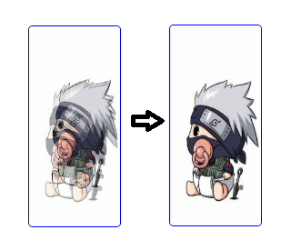

# remove-drag-ghosting
Remove drag ghost

<a href="https://www.npmjs.com/remove-drag-ghosting" target="_blank"></a>
<a href="https://www.npmjs.com/remove-drag-ghosting" target="_blank"></a>
<a href="https://www.npmjs.com/remove-drag-ghosting" target="_blank"></a>

# Demo

[Online](https://bojue.github.io/remove-drag-ghosting)



## Use

- npm 

```
// npm install 
npm install remove-drag-ghosting

// javascript
import removeGhosting from 'remove-drag-ghosting';

drag(event) {
    removeGhosting(event);
}
```

- function

```javascript

// html 


// javascript
let dragDom = document.getElementById('dragElement'); //dragElement
dragDom.addEventListener('mouseenter', removeGhosting);
dragDom.addEventListener('dragstart', removeGhosting);
dragDom.addEventListener('drag', removeGhosting);

function removeGhosting(event) {
    if(!(event instanceof MouseEvent)) {
        console.info("Parameters must be of type MouseEvent!")
        return;
    }
    let dragIcon = document.createElement('img');
    let url = 'data:image/gif;base64,R0lGODlhAQABAIAAAAAAAP///yH5BAEAAAAALAAAAAABAAEAAAIBRAA7';
    dragIcon.src = url;
    dragIcon.width = 0;
    dragIcon.height = 0;
    dragIcon.opacity = 0;
    if(event.dataTransfer) {
        event.dataTransfer.setDragImage(dragIcon,0, 0);
    }
}
```
## License

[MIT](https://opensource.org/licenses/MIT)
